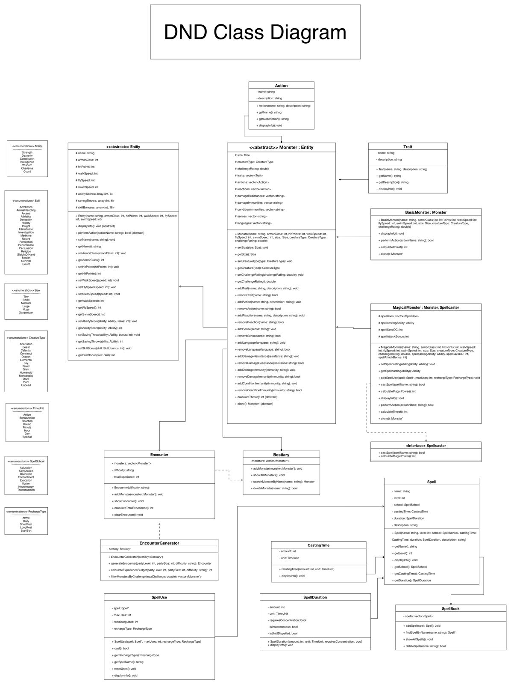

# D&D Encounter Engine (C++)

A console program that models Dungeons & Dragons 5e monsters and spells and
generates combat encounters for a party. Built as my final project for my
programming class at USFQ.

> **Status: incomplete.** The data model, spellbook and encounter generator work.
> The combat loop is an early prototype and has known bugs (listed below).

## What it does

- **Spellbook:** add, find, delete and list spells, saved to and loaded from
  `SpellBook.json`
- **Bestiary:** a set of monsters (Goblin, Wolf, Cult Mage) with stats, traits,
  actions, senses and languages
- **Encounter generator:** takes party level, party size and difficulty
  (`easy`, `medium`, `hard`, `deadly`), filters the bestiary by challenge
  rating and fills an experience budget with random monsters
- **Combat (prototype):** roll against the monsters in the encounter until
  they are defeated

## Design



- `Entity` (abstract) holds what every creature has: armor class, hit points,
  speeds, ability scores, saving throws and skills.
- `Monster` (abstract) extends it with size, creature type, challenge rating,
  traits, actions, resistances and immunities.
- `BasicMonster` and `MagicalMonster` are the concrete monsters.
  `MagicalMonster` also implements the `Spellcaster` interface and casts spells
  through `SpellUse`, which tracks uses and recharge.
- `Spell` is composed of `CastingTime` and `SpellDuration`; `SpellBook` stores
  spells and serializes them with [nlohmann/json](https://github.com/nlohmann/json)
  (vendored in `include/`).
- `Bestiary` owns the monsters; `EncounterGenerator` picks from it to build an
  `Encounter`.

## Building

```sh
g++ -std=c++17 -Iinclude *.cpp -o dnd
./dnd
```

## Known issues

- **Encounters share monsters with the bestiary.** `EncounterGenerator` stores
  the bestiary's own pointers, so three Goblins in an encounter are one object
  and damage in a fight changes the bestiary itself. `Monster::clone()` already
  exists and is the fix.
- **Damage lowers Armor Class instead of Hit Points.**
- **The wrong monster is removed.** Attacks always hit `monsters[0]`, but a kill
  calls `pop_back()`, which removes the last monster; the first one stays with
  Armor Class at or below 0, so every later hit "kills" another monster.
- **Hit rules aren't D&D yet.** A roll of 1–6 misses and 7–12 hits; 5e uses a
  d20 plus attack bonus against Armor Class.
- **Non-numeric input** makes the menus loop forever (`std::cin` is never cleared).
- **Invalid menu choices fall back silently**, e.g. an invalid spell school
  becomes Abjuration.
- **Doesn't build on Linux:** `serialization.cpp` includes `"Serialization.h"`
  but the file is `serialization.h` (macOS ignores the case difference).
- **Unfinished files:** `encounter_administrator.*` and `MonsterSerialization.*`
  are empty, and monsters are hard-coded in `main.cpp` instead of loaded from JSON.

## Next steps

1. Fix the combat bugs above (clone monsters, damage hit points, d20 attack rolls).
2. Load the bestiary from JSON, like the spellbook.
3. Split the combat loop out of `main.cpp` into its own class.
